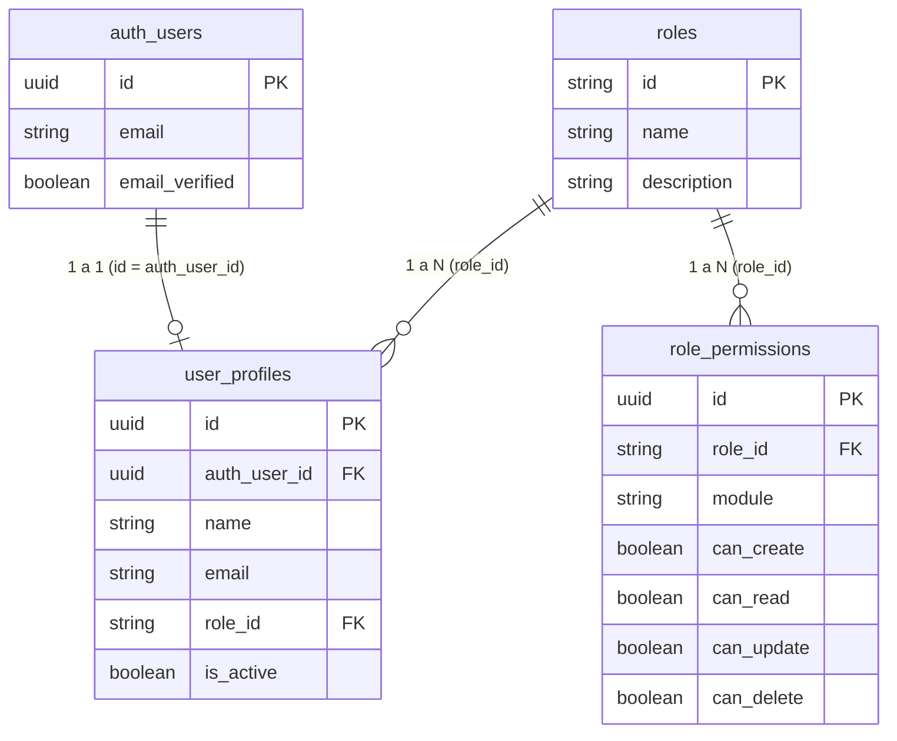

# 🛠️ VetHD - Backend & Database Service


> **Proyecto Universitario**: Backend y Base de Datos para Sistema Clínico Veterinario  
> **Curso**: Herramientas de Desarrollo (**HD**)  
> **Proyecto Backend**: InsForge BaaS (`https://c2g6m52b.us-east.insforge.app`)  

---

## 📖 Descripción General

Este repositorio contiene la arquitectura de base de datos PostgreSQL, script de migraciones SQL, cliente InsForge SDK y la suite de pruebas unitarias para el backend del proyecto **VetHD**.

---

## 🗄️ Esquema de Base de Datos (Épica 1)

El backend utiliza PostgreSQL administrado vía PostgREST con InsForge BaaS.



---

## 🚀 Migraciones y Semilla de Datos

La migración inicial de la Épica 1 se encuentra en [`migrations/01_epic1_users_roles.sql`](file:///C:/Proyectos%20-%20Navarro/Softwares/09-veterinaria%20HD/hd-veterinaria-backend/migrations/01_epic1_users_roles.sql):

- Crea las tablas `roles`, `role_permissions` y `user_profiles`.
- Inserta los 3 roles del sistema (`role-admin`, `role-vet`, `role-recep`).
- Configura las 3 cuentas de usuario iniciales en `auth.users` y `user_profiles`:
  1. `admin@veterinariahd.com` (Dr. Fernando Delgado)
  2. `vet.montes@veterinariahd.com` (Dra. Sofía Montes)
  3. `carlos.recepcion@veterinariahd.com` (Carlos Ramírez)

---

## 🧪 Pruebas Unitarias

Para ejecutar la suite de pruebas unitarias del backend:

```bash
npm test
```

### Resultados de Cobertura (16/16 Pass)
- Pruebas de autenticación y hashing de contraseñas.
- Pruebas de validación de correo y control de intentos fallidos.
- Pruebas de asignación de roles y permisos.

---

## ⚙️ Ejecución del CLI de InsForge

Para ejecutar consultas directas contra la base de datos de producción:

```bash
# Consultar usuarios de la base de datos
npx @insforge/cli db query "SELECT * FROM user_profiles;"

# Ejecutar una migración SQL
npx @insforge/cli db query -f migrations/01_epic1_users_roles.sql
```

---

## 🌿 Flujo de Trabajo (GitFlow)

- `main`: Rama principal de lanzamientos estables.
- `develop`: Rama de desarrollo e integración continua backend.
- `feature/HU-xx-*`: Ramas de tareas e historias de usuario backend.

---

## 📄 Licencia

Desarrollado para el curso de **Herramientas de Desarrollo (HD)** &copy; 2026.